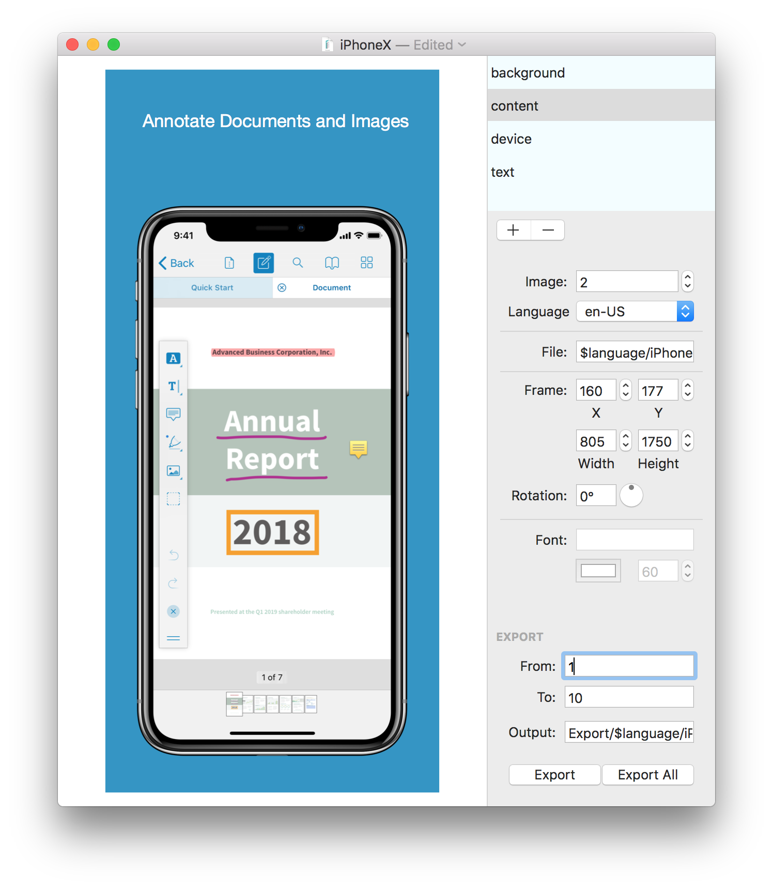

Screenshot Framer Process Documentation
================

# Requirements

### fastlane

You need to have the latest version of fastlane, which you can get [here][fastlane setup]. If you already have an older version of fastlane installed, you can update with the following command.

```
bundle install
```

### MindNode Screenshot-Framer

There's two ways to generate the framed screenshots, either via their application or via the command line with the `Screenshot-Framer-CLI`, both which can be downloaded from their [GitHub repository][MindNode Screenshot Framer].

If you choose to use the CLI, which is highly recommended, then you just have to move the `Screenshot-Framer-CLI` file to your `/usr/local/bin` path for it to be useable.

The application is just needed for opening the project files which are already in `/Viewer-iOS/fastlane/screenshots`.


### Time

Generating all the screenshots with the `generate_screenshots` fastlane action takes a lot of time, usually around **15 hours**, so it's best to start that before going to bed. Then there is a high possibility that some screenshots for some devices/languages will fail, which means that there needs to be a second run of the fastlane action to only generate those (please move the rest of the screenshots to a separate folder outside of `screenshots`, as they will otherwise be deleted when generating new screenshots). Creating the framed screenshots only takes about **5-15 minutes**.
All in all the whole screenshot process could take about **2-3 nights**, so please start preparing those in time.

# Introduction



I'll only describe the parts which we used to create the framed screenshots.

There are four objects/parts that all come together for the final framed screenshot:
* **Background**: The background of the image. This determines the final dimensions/resolutions of the screenshot, which need to fit perfectly for each device. All dimensions and resolutions can be found on [this iTunes Connect page][Device Dimensions].
* **Content**: These are the screenshots which are created with fastlane's snapshot tool, which can be done [via the command line][Generate Screenshots].
* **Device**: This is the device frame of each device type that we use.
* **Text**: This is the localized text which is presented above the device.

Then we have the only two variables in this process, `image` and `language`:
* **image:** We need 10 framed screenshots and each of those needs a separate background, content, and text. The variable is used in the following contexts:
  - Background image in `backgrounds`: '`$image`.png'
  - Choosing the right screenshot from the `$language` folders: e.g. 'iPad Pro (10.5-inch)-`$image`.png'
  - Key for text localization: '"`$image`" = "Localized String";'
* **language:** Determines the language in which the text and the content will be displayed. It is also very important for the output location of all framed screenshots, as each of them needs to be stored in the matching language folder.
  - Choosing the right language for the `content` part: '`$language`/iPad Pro (10.5-inch)-`$image`.png'
  - Choosing the right language for the the `text` part: '`$language`/screenshots.strings'

There's a file path to include all those files in the Screenshot-Framer project.
* **File:** Path to the files of the four parts mentioned above.

Now all the parts need to be aligned on the background. Please be really careful when changing those, as there are no safety checks to keep the aspect ratio intact. All ratios of an object have been manually set and adapted to each other.
* **Frame:**
  * X/Y: These coordinates determine the location of the part, always starting from the bottom left.
  * Width/Height: Those determine the width and height of the selected part.

The text needs to be at a readable size.
* **Font (Size):** It currently varies from 35~60 depending heavily on the device type. It needs to be a size where the text is easy to read for the user but also shouldn't take up too many lines.

Last but not least we need to export those finished screenshots.
* **From:** Starting point from which image we should begin. Should be the first `$image` variable.
* **To:** Ending point. Should be the last screenshot. Should be the last `$image` variable.
* **Output:** This is the path where the finalized framed screenshots will be generated.
* **Export:** Tapping this button will only create a final screenshot for currently selected language and image.
* **Export All:** Tapping this button will create the final screenshots for all available languages and images. This should usually be used when creating the screenshots.

# Generating the Framed Screenshots

## From the Command Line

1. First you need to locate to your the project directory `/Viewer-iOS/fastlane/screenshots` in your terminal.
2. To create all framed screenshots from all available projects enter the following command into your terminal:
```
Screenshot-Framer-CLI -project .
```

**Note:** You can also create framed screenshots of a single device by adding the project parameter at the end. An example is the following:
```
Screenshot-Framer-CLI -project ./iPhoneX.frame
```

All generated framed screenshots will be located in `/Viewer-iOS/fastlane/screenshots/Export`.

## With the Screenshot Framer Application

We currently have 7 Screenshot Framer project files, one for each screen size/resolution:
* iPhone 5s
* iPhone 7
* iPhone 7Plus
* iPhone X
* iPad 9.7
* iPad 10.5
* iPad 12.9

1. Go to `/Viewer-iOS/fastlane/screenshots` in the Finder.
2. Open all projects mentioned above
3. Tap on `Export All` in each open project

All generated framed screenshots will be located in `/Viewer-iOS/fastlane/screenshots/Export`.


# Troubleshooting

There are some errors that can come up while testing in the `ViewerUITests.swift` file or when running `fastlane iOS generate_screenshots`. Usually all of these come up without a good reason whatsoever, so you can ignore them and just re-run the build or command.

Errors in Xcode usually occur before the real test starts in files unrelated to `ViewerUITests.swift`

Errors in the command line can look like the following:


The timeout error can be easily fixed by changing the environment variable as described in the error message. You also add the following to the `Fastfile` along the other environment variable stuff:

```
ENV["FASTLANE_XCODEBUILD_SETTINGS_TIMEOUT"] = "180"
ENV["FASTLANE_XCODE_LIST_TIMEOUT"] = "180"
```

# Why we did some things the way we did them

* **Folder Structure**: There are only 3 folders which are not automatically recognized as localization folders: backgrounds, device_frames, Export. All the other ones are recognized as a language and would therefor create a separate language folder when generating the screenshots.
* `background` and `device_frames` folders inside the same-named parent folders. This is done because the `generate_screenshots` fastlane action deletes only files inside the first parent folders inside the `screenshots` folder (e.g. the localization folders: de-DE, en-US, etc) as that's where the screenshots are created/stored, because we want to delete those when generating new screenshots. However, folders inside those folders and their content, as well as files in the `screenshots` parent folder are not deleted, so that's why we handled it like we did. More or less a workaround since we can't really change stuff in fastlane and/or the screenshot framer.

[fastlane setup]: https://docs.fastlane.tools/#getting-started
[MindNode Screenshot Framer]: https://github.com/IdeasOnCanvas/ScreenshotFramer/releases
[Device Dimensions]: https://help.apple.com/itunes-connect/developer/#/devd274dd925
[Generate Screenshots]: https://github.com/PSPDFKit/Viewer-iOS/tree/master/fastlane#ios-generate_screenshots
